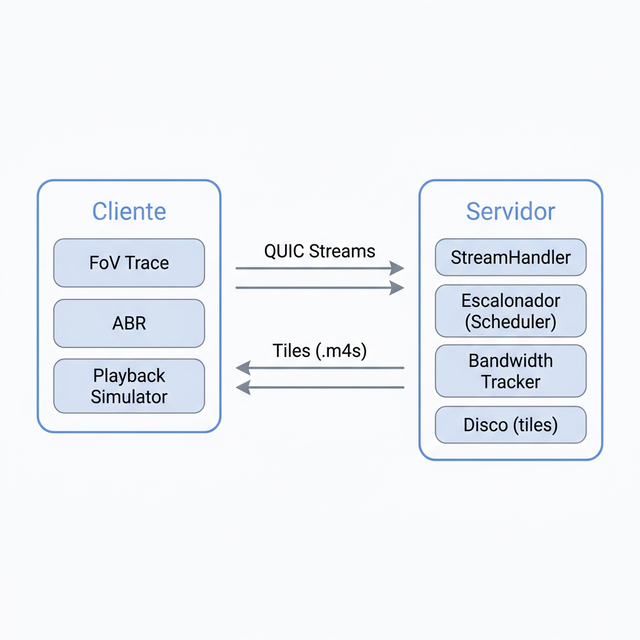
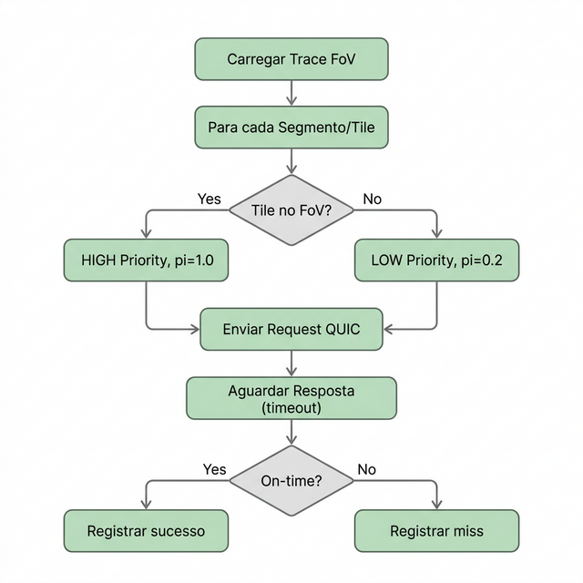
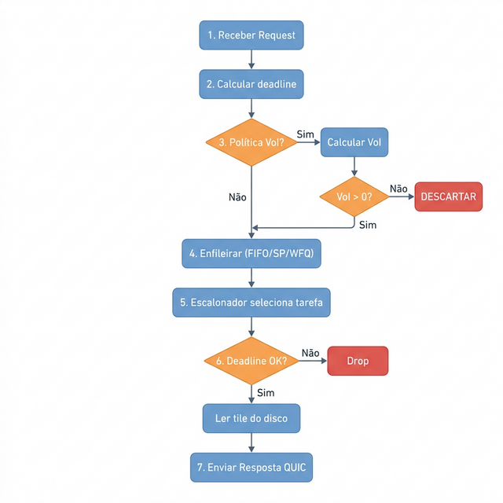
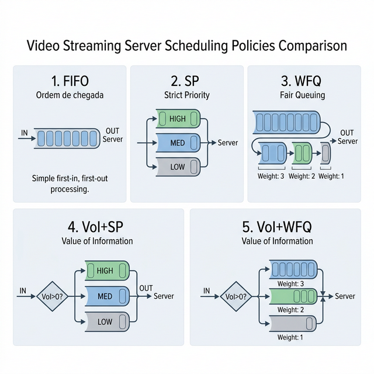
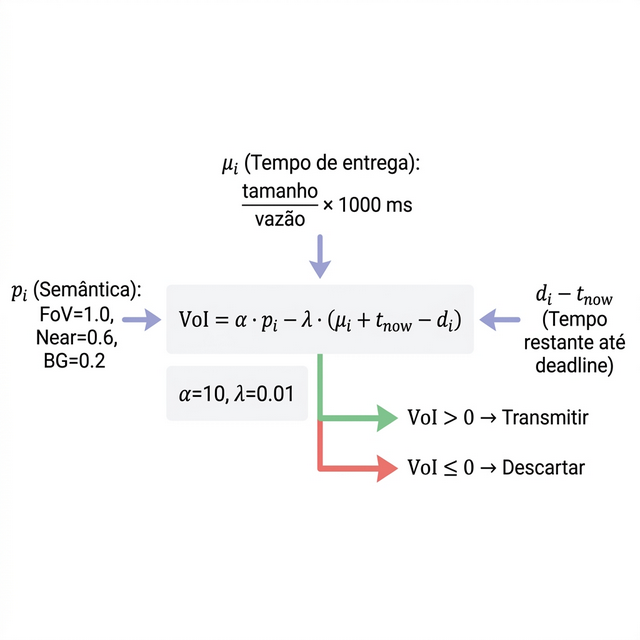

# TccQuic — Streaming de Vídeo Imersivo sobre QUIC

Sistema cliente-servidor para entrega de vídeo em mosaico (_tiled video_) sobre o protocolo QUIC, com escalonamento baseado em **Valor da Informação (VoI)** e políticas de fila (FIFO, SP, WFQ).

## Requisitos

- **Go 1.19.x** (obrigatório — a biblioteca `quic-go v0.31` não é compatível com versões superiores)
- Repositório clonado: `https://github.com/quic-streaming/tcc`

## Como Executar

```bash
# Servidor (escolha a política de fila)
go run main.go server fifo
go run main.go server sp
go run main.go server wfq
go run main.go server voi_sp
go run main.go server voi_wfq

# Cliente de teste
go run main.go test-client <ip> <paralelismo> <latência_base_ms>
# Exemplo:
go run main.go test-client localhost 128 250
```

---

## Arquitetura Geral



O **cliente** solicita tiles de vídeo organizados por segmento e tile. O **servidor** recebe as requisições, coloca na fila do escalonador e responde com os dados do tile lido do disco.

---

## Estrutura do Projeto

```
TccQuic/
├── main.go                          # Ponto de entrada
├── src/
│   ├── model/                       # Modelos compartilhados
│   │   ├── constants.go             # Priority, Bitrate
│   │   ├── video-packet.go          # Request/Response (serialização)
│   │   └── voi.go                   # Cálculo do Valor da Informação
│   ├── server/
│   │   ├── server.go                # Listener QUIC
│   │   ├── bandwidth/
│   │   │   └── tracker.go           # Estimativa de vazão
│   │   ├── stream_handler/
│   │   │   ├── stream_handler.go    # Orquestração de streams
│   │   │   ├── task_scheduler.go    # Escalonador (FIFO/SP/WFQ/VoI)
│   │   │   └── scheduler/           # Implementação genérica (legado)
│   │   └── metrics/                 # Coleta de métricas (CSVs)
│   ├── client/                      # Cliente real (reprodutor)
│   └── test_client/                 # Cliente de teste (simulação)
│       ├── test_client.go           # Loop principal de requisições
│       ├── client.go                # Conexão QUIC
│       ├── fov_trace.go             # Leitura de trace de FoV
│       └── playback_simulator.go    # Simulação de reprodução
├── data/segments/                   # Arquivos de tile (.m4s)
└── scripts/mininet/                 # Scripts de teste em rede emulada
```

---

## Fluxo do Cliente



Para cada segmento de vídeo, o cliente consulta o **trace de FoV** para identificar quais tiles estão no campo de visão. Tiles no FoV recebem prioridade alta e bitrate adaptativo; os demais recebem prioridade baixa.

---

## Fluxo do Servidor



O servidor recebe requisições via QUIC, calcula o deadline e, dependendo da política, pode calcular o VoI antes de enfileirar. Se o VoI for negativo, o tile é descartado imediatamente.

---

## Políticas de Escalonamento



| Política | Comando | Descarte VoI | Ordenação |
|----------|---------|:---:|-----------|
| `fifo` | `server fifo` | ✗ | Ordem de chegada |
| `sp` | `server sp` | ✗ | HIGH → MED → LOW |
| `wfq` | `server wfq` | ✗ | Round-robin com pesos 3:2:1 |
| `voi_sp` | `server voi_sp` | ✓ | HIGH → MED → LOW |
| `voi_wfq` | `server voi_wfq` | ✓ | Round-robin com pesos semânticos |

---

## Valor da Informação (VoI)



O VoI determina se vale a pena transmitir um tile, considerando sua importância perceptual e o estado atual da rede.

### Fórmula

```
VoI_i = α · p_i − λ · (μ_i + t_now − d_i)
```

### Parâmetros

| Símbolo | Significado | Valor padrão |
|---------|-------------|:---:|
| `p_i` | Prioridade semântica (FoV=1.0, Near=0.6, BG=0.2) | — |
| `α` | Peso da semântica | 10 |
| `λ` | Penalização por atraso | 0.01 |
| `μ_i` | Tempo estimado de entrega = tamanho / vazão × 1000 (ms) | — |
| `d_i` | Deadline absoluto do tile | — |

### Estimativa de Vazão (μ_i)

O servidor mantém um **rastreador de banda** (`bandwidth/tracker.go`) com janela deslizante de 2 segundos:

1. Cada tile enviado com sucesso registra `(timestamp, bytes)`
2. Amostras fora da janela são descartadas
3. `Vazão = Σ bytes / Δt`
4. `μ_i = tamanho_tile / vazão × 1000 ms`

---

## Métricas Geradas

### Lado Servidor (CSVs em `/tmp/server_scheduler_test/`)

| Arquivo | Conteúdo |
|---------|----------|
| `reqlog.csv` | Tempos por requisição (qd, svc, rsp), on-time, drop |
| `class_agg.csv` | Agregados por classe (bytes, delays, on-time ratio) |
| `queue_len.csv` | Tamanho das filas por classe (amostrado a cada 100ms) |
| `fairness.csv` | Índice de Jain entre classes (a cada 1s) |
| `wfq_utilization.csv` | Share real vs peso teórico por classe (a cada 1s) |
| `work_conserving.csv` | Tempo ocioso com fila não-vazia (a cada 1s) |
| `server_summary.csv` | Resumo final (shares, Jain, throughput, drops) |

### Lado Cliente

| Arquivo | Conteúdo |
|---------|----------|
| `statistics-<pid>.csv` | Detalhes por requisição |
| `statistics-summary-<pid>.csv` | Resumo (join latency, completion rate, stale bytes) |
| `abr-decisions-<pid>.csv` | Decisões do ABR por segmento (configuração, bitrate, throughput, buffer) |
| `fov-delivery-<pid>.csv` | Taxa de entrega FoV por segmento |
| `fov-goodput-<pid>.csv` | Goodput útil (FoV on-time) por janela |

---

## Validação dos ABRs `bola` e `legacy`

Para validar os dois ABRs do cliente no simulador Mininet, o projeto agora grava um CSV adicional com as decisões do algoritmo:

- `abr-decisions-<pid>.csv`

Esse arquivo registra, por segmento:

- `cfg_id`
- `fov_bitrate`
- `nonfov_bitrate`
- `avg_throughput_Bps`
- `buffer_level_s`
- `time_budget_s`

### Execução recomendada

```bash
cd scripts/mininet
./run_abr_validation.sh <IP_DO_MININET>
```

O script executa quatro casos:

- `bola_sanity`
- `legacy_sanity`
- `bola_constrained`
- `legacy_constrained`

### Entradas recomendadas para validação

Caso de sanidade:

- `--wfq --sbw 100 --cbw 100 --loss 0 --delay 5 --load 0 --baselatency 120 -p 120`

Caso restrito:

- `--wfq --sbw 60 --cbw 50 --loss 4 --delay 20 --load 30 --baselatency 800 -p 120`

### Saídas esperadas

No `statistics-summary-<pid>.csv` para o caso de sanidade:

- `segment_completion_rate_percent >= 95`
- `stale_bytes_ratio_percent <= 5`
- `deadline_miss_rate_fov_percent <= 5`
- `deadline_miss_rate_nonfov_percent <= 5`
- `fov_hit_rate_delivery_percent >= 95`
- `timely_bytes_ratio_percent >= 95`

No `abr-decisions-<pid>.csv`:

- para `bola`, `cfg_id` deve ser apenas `A_all_low`, `B_fov_med` ou `C_fov_high`
- para `bola`, `nonfov_bitrate` deve permanecer `3`
- para `legacy`, `cfg_id` deve ser `default`
- para `legacy`, `fov_bitrate` deve estar em `{3, 5, 10}` e `nonfov_bitrate` deve ser `3`

Validação manual de um diretório específico:

```bash
python3 scripts/mininet/resources/validate_abr_metrics.py logs/server_scheduler_test/...
```
