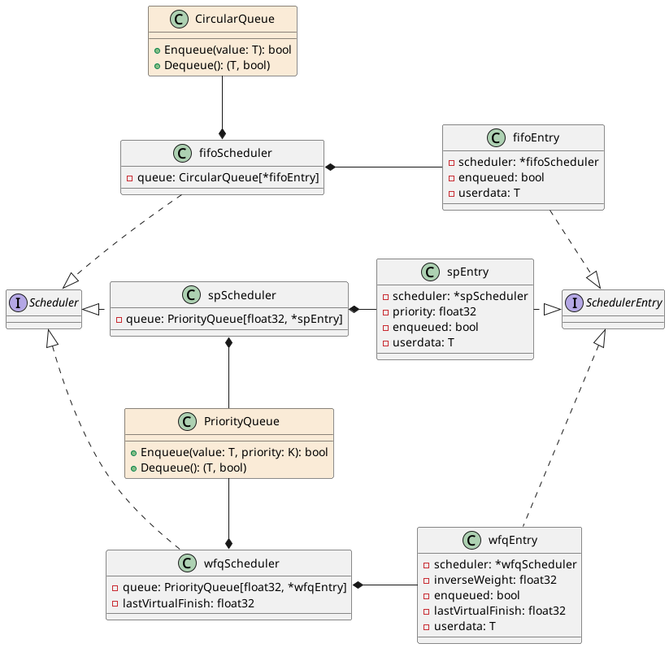

# Server Scheduler

* [Public API](#public-api)
* [Implementation details](#implementation-details)

## Public API

The public API exposes the `Scheduler` and `SchedulerEntry` interfaces,
and the `NewFIFO`, `NewSP` and `NewWFQ` top-level functions, shown in the
UML as static methods of `Scheduler`.

A `Scheduler` shall be instantiated via the `NewFIFO`, `NewSP` or `NewWFQ`
top-level functions. The general usage of a `Scheduler` is:

1. A entry is created via the `CreateEntry` method.
    * The `userdata` parameter that is passed is an arbitrary value provided
      by the caller that can be recovered via the `UserData` method.
2. The priority for the entry is set using `SetPriority`.
3. The entry is added to the scheduler queue by via the `Enqueue` method.
    * Once the entry is enqueued, changing the priority has no effect.
4. When it is desired to get the entry that should be served, the `Dequeue`
   method is called.
5. After the entry is served, if all work related to it is done, one can simply
   stop using it. Otherwise, it can be enqueued again to the scheduler via the
   `Enqueue` method.
    * The "enqueue again" pattern is needed in order for WFQ to guarantee
      fairness.

The priority of the `SchedulerEntry` is used as the strict priority in the
SP scheduler, as the weight in the WFQ scheduler, and ignored in the FIFO
scheduler.

A given entry can only be used with the scheduler that created it.

## Implementation details

The details for the `Scheduler`, `SchedulerEntry` interfaces are hidden in the
above diagram. See [Public API](#public-api) for more.
