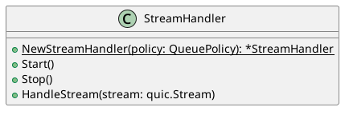
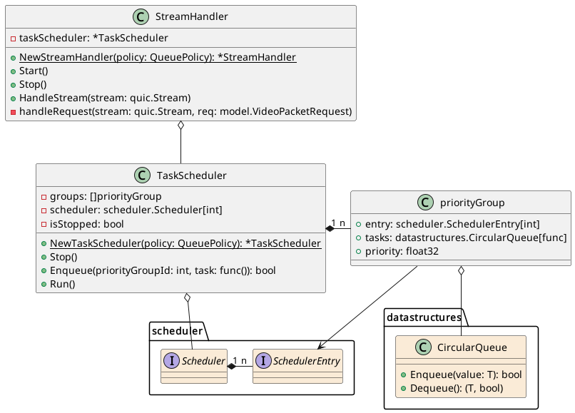
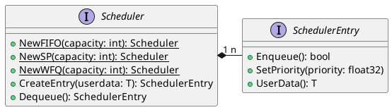
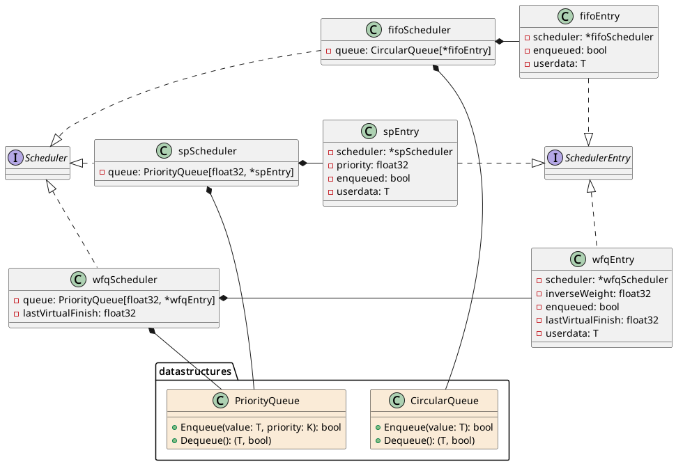

# Stream Handler documentation

* [`stream_handler`](#stream_handler)
* [`stream_handler/scheduler`](#stream_handlerscheduler)

## `stream_handler`

Thread that handles the streams of the server.

### Public API

The public API exposes the `StreamHandler` struct and the `NewStreamHandler`
top-level function, shown in the UML as static method of `StreamHandler`.

The struct `StreamHandler` represents a thread which handles streams for a
connection. It should be instantiated for each connection opened. Then, the
thread is started via the call to `Start` and the streams are handled
via `HandleStream`.

When the connection is closed, `Stop` can be used to stop the thread.

`Start` and `Stop` are non-blocking. `HandleStream` blocks only while the
request is received; the actual handling of the request and sending the
response is done asynchronously.

### Implementation details

* `StreamHandler`: The `handleRequestMethod` is called by the `TaskScheduler`
  according to the scheduler policy. The enqueueing of this task is done via
  the `HandleStream` method. Additional methods and members are hidden in
  the diagram for simplicity.
* `TaskScheduler`: Wraps the `Scheduler` in a thread-safe struct. `Run` blocks
  and executes tasks added via `Enqueue`, until `Stop` is called.
* `priorityGroup`: Auxiliary struct for `TaskScheduler`. Represents a group
  of tasks of same priority. The tasks within the group are executed as FIFO.
* `scheduler` package: See
  [`stream_handler/scheduler`](#stream_handlerscheduler).
* `datastructures` package: Auxiliary data structures.

## `stream_handler/scheduler`

Synchronous logic of the scheduler.

### Public API

The public API exposes the `Scheduler` and `SchedulerEntry` interfaces,
and the `NewFIFO`, `NewSP` and `NewWFQ` top-level functions, shown in the
UML as static methods of `Scheduler`.

A `Scheduler` shall be instantiated via the `NewFIFO`, `NewSP` or `NewWFQ`
top-level functions. The general usage of a `Scheduler` is:

1. A entry is created via the `CreateEntry` method.
    * The `userdata` parameter that is passed is an arbitrary value provided
      by the caller that can be recovered via the `UserData` method.
2. The priority for the entry is set using `SetPriority`.
3. The entry is added to the scheduler queue by via the `Enqueue` method.
    * Once the entry is enqueued, changing the priority has no effect.
4. When it is desired to get the entry that should be served, the `Dequeue`
   method is called.
5. After the entry is served, if all work related to it is done, one can simply
   stop using it. Otherwise, it can be enqueued again to the scheduler via the
   `Enqueue` method.
    * The "enqueue again" pattern is needed in order for WFQ to guarantee
      fairness.

The priority of the `SchedulerEntry` is used as the strict priority in the
SP scheduler, as the weight in the WFQ scheduler, and ignored in the FIFO
scheduler.

A given entry can only be used with the scheduler that created it.

### Implementation details

The details for the `Scheduler`, `SchedulerEntry` interfaces are hidden in the
above diagram.

* `spScheduler`: Scheduler created by `NewSP`. Contains a single priority
  queue (binary heap).
* `spEntry`: `SchedulerEntry` of `spScheduler`.
* `fifoScheduler`: Scheduler created by `NewFIFO`. Contains a single circular
  queue.
* `fifoEntry`: `SchedulerEntry` of `fifoScheduler`.
* `wfqScheduler`: Scheduler created by `NewWFQ`. Contains a single priority
  queue (binary heap) and stores the `lastVirtualFinish`, i.e. the virtual
  timestamp of the time the last entry was dequeued.
* `wfqEntry`: `SchedulerEntry` of `wfqScheduler`. Stores the
  `lastVirtualFinish`, i.e. the virtual timestamp of the time this entry
  was last dequeued. The weight is stored inversed (`1 / weight`) in order
  to facilitate the implementation.
* `datastructures` package: Auxiliary data structures.
